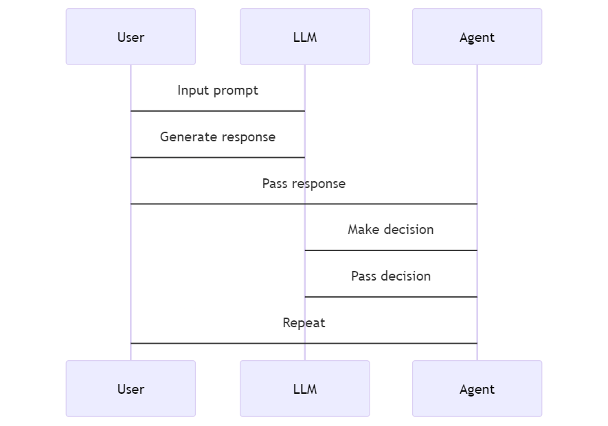
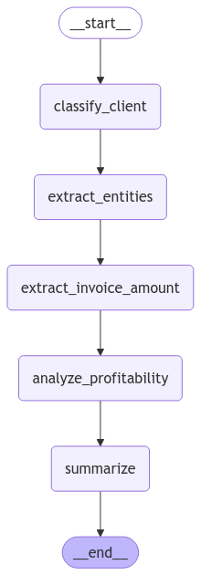
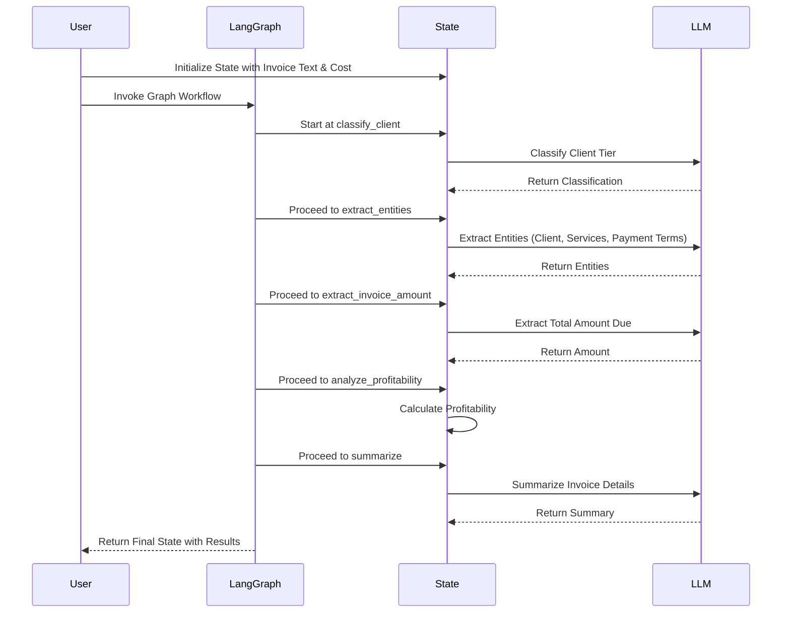

# Invoice Analysis AI Agents with LangGraph (Coding Tutorial)

This project provides a Python-based pipeline for processing invoices using LangGraph agents and tools. It extracts key details from an invoice, classifies the client into tiers (Silver, Gold, Platinum), calculates profitability based on user-supplied service costs, and generates a profitability summary.

---

## 🚀 Features

- **Client Tier Classification**: Automatically classifies clients based on the total invoice amount.
- **Entity Extraction**: Extracts entities like client name, services provided, and total amount due.
- **Profitability Analysis**: Calculates total costs, profit, and classifies whether the client is profitable.
- **Summarization**: Generates a concise profitability summary.

---

This repository serves as a companion to the PydanticAI Masterclass and its third video tutorial **[Invoice Analysis AI Agents with LangGraph (Coding Tutorial)](https://www.youtube.com/watch?v=XXXXXXX)** which introduces a LangGraph-based data processing pipleine through practical examples.

[](https://www.youtube.com/watch?v=XXXXXXX)

---

## 🙋 Looking for Collaborators

Have an idea for an article, video tutorial, a learning project or anything related to AI? Consider collaborating with our growing community of collaborators. Get started today by [posting your idea on our Discord sever](https://discord.gg/eQXBaCvTA9). Together, we are building a strong community of AI Software Developers.

## 😍 How to Contribute to This Repository

This repository is maintained by the team at **[AI Software Developers](https://www.youtube.com/@AISoftwareDevelopers)** channel. Contributions are welcome! If you'd like to contribute, please check out the contribution guidelines and submit a PR.

---

## Prerequisites

1. **Python 3.8+**
2. Install the required libraries:
   ```bash
   pip install langgraph langchain_openai dotenv
   ```
3. Set up an OpenAI API key. Create a `.env` file with the following content:
   ```
   OPENAI_API_KEY=your_openai_api_key
   ```

---

## How LangChain Works

LangChain is a framework designed to simplify the development of applications powered by large language models (LLMs). It allows developers to build tools and workflows by combining pre-built components such as:

- **LLM Wrappers**: Integrations with APIs like OpenAI or Hugging Face.
- **Chains**: Sequences of tasks that interact with the model.
- **Memory**: Components for retaining conversational context.

LangChain enables seamless interaction with language models for tasks like document generation, question answering, and decision-making.

### LangChain Interaction Diagram

Below is a conceptual diagram of how LangChain components interact:



---

## Introduction to LangGraph

LangGraph is a framework for creating applications using graph-based workflows. Each node represents a function or computational step, and edges define the flow between these nodes based on certain conditions.

### Key Features of LangGraph

- **State Management**: Maintain the context throughout the workflow.
- **Flexible Routing**: Dynamically determine the next steps based on conditions.
- **Persistence**: Store and retrieve workflow states easily.
- **Visualization**: Generate visual representations of workflows for better debugging and understanding.

### How Agents Work in General

Agents are autonomous programs that perform tasks by:

1. **Perceiving Inputs**: Receiving data or context from the environment.
2. **Processing Data**: Applying logic, rules, or language models.
3. **Acting**: Generating outputs, making decisions, or invoking tools.

LangGraph agents use predefined tools and logic to dynamically process inputs and deliver actionable insights.

### Tutorial: Invoice Analysis Pipeline - Data Extraction, Classification and Processing

LangGraph can be used to create modular, extensible workflows for processing invoices and extracting key details. For example, an invoice classification and extraction pipeline could include the following stages:

1. **Client Tier Classification**: Categorize clients based on the total invoice amount (e.g., Silver, Gold, or Platinum).
2. **Entity Extraction**: Identify and extract key details such as client name, services provided, and payment terms from the invoice text.
3. **Profitability Analysis**: Analyze the profitability by comparing the total amount due with the cost of services.
4. **Summary Generation**: Generate a concise summary of the invoice details and profitability.

This pipeline demonstrates how LangGraph can be leveraged to create workflows that are modular, easy to modify, and adaptable to various business needs.

### LangGraph Pipeline Diagram

Below is the LangGraph workflow for this invoice classification agent graph:



---

## Usage

### Example Invoice

Here's a sample invoice text:

```plaintext
Invoice #12345
Client: Acme Corp
Services Provided: Consulting, Training, Support
Total Amount Due: $286000
```

### Running the Script

1. Add your invoice text and service costs into the script:

   ```python
   example_invoice = """
   Invoice #12345
   Client: Acme Corp
   Services Provided: Consulting, Training, Support
   Total Amount Due: $250000

   Services:
    1. Web Development - $150,000
    2. SEO Optimization - $50,000
    3. Social Media Management - $30,000
    4. Content Creation - $26,000
    5. Email Marketing - $20,000
    6. Graphic Design - $10,000
    """
   ```

2. Run the script:
   ```bash
   python main.py
   ```

### Expected Output

After processing, you will see structured output like:

```plaintext
Processed Invoice Data:
{
    'client': 'Acme Corp',
    'services': ['Consulting', 'Training', 'Support'],
    'total_amount': 286000.0,
    'tier': 'Gold',
    'profitability_summary': 'Client Acme Corp is classified as Gold tier. Total revenue: $286,000.00. Total cost: $100,000.00. Profit: $186,000.00.'
}
```

---

## 🧑‍💻 Pipeline Overview

The pipeline uses **LangGraph** tools to process invoices in five steps:

1. **Classify Client Tier**: Categorizes clients into Silver, Gold, or Platinum.
2. **Extract Entities**: Retrieves key data such as client name and services.
3. **Extract Total Amount**: Extracts the total invoice amount.
4. **Analyze Profitability**: Compares invoice revenue with service costs.
5. **Generate Summary**: Produces a concise summary of the client's financial contribution.

---

### Data Pipeline Sequence Diagram

Below is a conceptual pipeline diagram for invoice analysis and classification:



---

## ✅ Extending the Script

You can customize the pipeline for additional use cases:

- Add new tools for advanced data extraction or calculations.
- Modify client classification thresholds.
- Integrate with external data sources like databases or APIs.

---

## Conclusion

This project demonstrates how LangGraph and AI-powered workflows can streamline complex processes like invoice processing, making them more efficient, accurate, and scalable. By leveraging modular tools for classification, extraction, and analysis, businesses can automate tedious tasks while gaining valuable insights into client profitability. Whether you're a developer exploring AI workflows or a business leader seeking actionable solutions, this pipeline provides a practical example of AI in action, ready to be adapted to various real-world scenarios.

---

## 🚀 AI in Action Series

- [Part 1: Invoice Analysis AI Agents with LangGraph (Coding Tutorial))](https://www.youtube.com/watch?v=XXXXXX)

### **Series Structure**

Each video in the series follows a consistent format:

1. **Introduction**:

   - Introduce the business problem/use case
   - Highlight the importance of solving it
   - Briefly mention the AI solution/tool to be used

2. **Tools & Setup**:

   - Introduce the tools and frameworks (e.g., LangChain, PydanticAI, OpenAI API, etc.)
   - Discuss prerequisites (libraries, APIs, or frameworks)

3. **Theory in Action**:

   - Provide a brief overview of the AI concept behind the solution (e.g., RAG, embeddings, dependency injection)
   - Explain how the theory applies to the specific use case

4. **Demo**:

   - Walk through the implementation step by step
   - Showcase the solution in action

5. **Conclusion**:
   - Recap what the solution achieved
   - Mention potential extensions or scaling options

---

### **Series Topics**

#### **AI Agents**

1. **"AI Customer Support Agent: Automating 24/7 Query Handling"**

   - Tools: LangChain, OpenAI API
   - Problem: Scaling customer service without increasing cost

2. **"AI Sales Assistant: Automating Lead Qualification"**
   - Tools: AI agents + CRM integration
   - Problem: Automating repetitive sales qualification tasks

#### **RAG (Retrieval-Augmented Generation)**

3. **"RAG for Knowledge Management: AI-Powered Internal FAQs"**

   - Tools: LangChain, vector databases (Weaviate or Pinecone)
   - Problem: Centralizing and retrieving company knowledge efficiently

4. **"AI for Document Review: Simplifying Legal Case Research"**
   - Tools: RAG + embeddings
   - Problem: Quickly retrieving relevant case laws for legal teams

#### **Chatbots**

5. **"Building a Chatbot for E-Commerce: Driving Personalized Recommendations"**

   - Tools: ChatGPT, custom prompts, database integration
   - Problem: Improving user experience in online shopping

6. **"Onboarding Chatbot: Simplifying Employee Induction Processes"**
   - Tools: PydanticAI, LangGraph
   - Problem: Reducing HR workload during onboarding

#### **Business Insights**

7. **"AI-Powered Market Research: Analyzing Competitor Data"**

   - Tools: Web scraping + sentiment analysis
   - Problem: Automating competitor tracking for strategic decisions

8. **"Automated Expense Analysis: Categorizing Costs with AI"**
   - Tools: OpenAI, Pandas
   - Problem: Streamlining accounting processes for SMBs

#### **Content Creation**

9. **"AI for Content Marketing: Generating SEO-Optimized Blog Posts"**

   - Tools: GPT APIs
   - Problem: Automating content creation for blogs and websites

10. **"Automating Social Media Campaigns with AI"**
    - Tools: AI agents + social media APIs
    - Problem: Generating captions and scheduling posts efficiently

---

### **Video Themes and Categories**

To maintain diversity, organize the 100 topics into **categories**:

- **AI for Customer Engagement**: Chatbots, AI agents, personalization
- **AI for Knowledge Management**: RAG, embeddings, intelligent document processing
- **AI for Productivity**: Task automation, scheduling, workflow optimization
- **AI for Business Intelligence**: Market analysis, dashboards, forecasting
- **AI for Content Creation**: Marketing campaigns, graphic generation, video scripting
- **AI for Operations**: Supply chain optimization, predictive maintenance.

---

## 🙋 Help and Support

If you encounter issues or have questions, feel free to open an issue in this repository, [ask a question on the Discord sever](https://discord.gg/eQXBaCvTA9).

## 🙏 Thank you

Thank you for contributing to this repository! Your efforts help create a valuable resource for the AI community. If you have any questions, feel free to reach out via [our Discord sever](https://discord.gg/eQXBaCvTA9) or open an issue in this repository. Let’s build a strong AI community together!

## 🤝 How You Can Contribute

We welcome contributions of all kinds, no matter your skill level or area of expertise. Here are some ways you can get involved:

1. **Share an Idea**: Have a suggestion for improving this project? Open an issue and share your thoughts.
2. **Report a Bug**: Encountered an issue? Let us know by submitting a detailed bug report.
3. **Write an Article**: Help others learn by writing blog posts, tutorials, or case studies about this project.
4. **Design Visuals**: Contribute by creating engaging designs, like a cover image for our YouTube video.
5. **Write Code**: Submit code samples, fixes, or improvements to our guides and resources.
6. **Review Pull Requests**: Share your feedback on code submissions to ensure quality and accuracy.
7. **Create a Video**: Produce educational or promotional videos for our YouTube channel.
8. **Enhance Documentation**: Improve clarity and accessibility in our README, guides, and comments.
9. **Build New Features**: Help extend the functionality of the project with innovative ideas.
10. **Test the App**: Perform quality assurance by testing features and reporting issues.

## 🚀 <a name="guidelines">Guidelines for Contributors</a>

To contribute as efficiently as possible, please follow these guidelines:

1. **[Read the Code of Conduct](../../CODE_OF_CONDUCT.md)**: Be respectful and constructive in your communications.
2. **Use Issues and Pull Requests**: Create an issue to discuss changes before submitting a pull request.
3. **Follow the Style Guide**: Adhere to the project’s coding and design standards.
4. **Provide Detailed Descriptions**: Include clear explanations and steps to reproduce for issues or changes.
5. **Test Your Work**: Make sure your contributions are bug-free and functional.
6. **[Read the Contribution Guide](../../CONTRIBUTING.md)**: Find out the best ways to contribute.

## 📬 <a name="getintouch">How to Get in Touch</a>

- **Discord Server**: [Join our community server](https://discord.gg/eQXBaCvTA9)
- **GitHub Issues**: Use the [Issues tab](https://github.com/aidev9/tuts/issues) to share ideas or report bugs
- **Social Media**: Connect with us on X [@AISoftwareDev9](https://-com/AISoftwareDev9)
- **Social Media**: Connect with us on Bluesky [@aidev9.bsky.social](https://bsky.app/profile/aidev9.bsky.social)

## 🌟 <a name="benefits">Why Contribute? The Benefits</a>

By contributing to this project, you’ll:

1. **Boost Your Portfolio**: Show off your contributions on GitHub, LinkedIn, or resumes.
2. **Learn and Grow**: Improve your skills by collaborating with a vibrant community of developers.
3. **Network with Peers**: Build relationships with contributors, maintainers, and industry professionals.
4. **Shape the Project**: Play a key role in the direction and success of the initiative.
5. **Gain Recognition**: Get credited in the README and shoutouts on social media.
6. **Learn AI Tools**: Deepen your understanding of AI tools by working hands-on with the latest and greatest platforms
7. **Improve Communication**: Enhance your technical writing and collaboration skills.
8. **Enjoy Creative Freedom**: Express your creativity through content, design, and code.
9. **Contribute to Open Source**: Be part of the open-source community, making resources free for all.
10. **Give Back**: Help others on their journey to mastering AI development.

## 🛠 Getting Started

1. Fork this repository.
2. Clone the fork to your local machine.
3. Create a new branch for your contribution.
4. Make your changes and test them thoroughly.
5. Push your branch and open a pull request.

Thank you for contributing.
