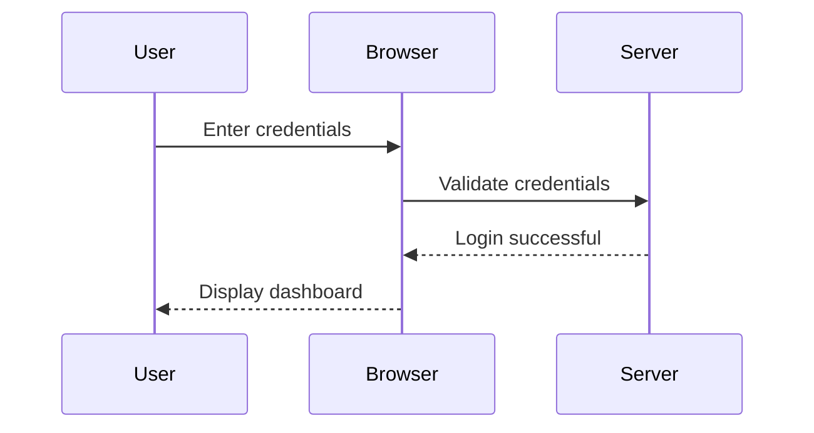

# 🧠 Building Mermaid Diagram Agents with smolagents

Welcome to the second tutorial in the **AI IN ACTION** series! In this tutorial, we’ll guide you through building an AI-powered workflow for generating **Mermaid diagrams**. By the end of this guide, you’ll have an agent capable of:

1. Generating a **Mermaid script** based on a user prompt.
2. Converting the Mermaid script into an image.
3. Saving and displaying the generated diagram via a web interface.

---

## **🚀 What You’ll Build**

This project involves:

- **User Interaction**: A prompt-based interface where users can describe their desired diagram.
- **Diagram Agent**: The agent will generate a Mermaid script from the prompt, convert it to an image, and return the output.
- **Web Interface**: Built using Gradio for seamless user interaction.

---

This repository serves as a companion to the AI IN ACTION series and its second video tutorial **[Create Stunning Mermaid Diagrams with AI Agents (AI IN ACTION)](https://www.youtube.com/watch?v=D7r1PtkxNYg)** which introduces a Mermaid generation pipeline using smolagents from Hugging Face.

[](https://www.youtube.com/watch?v=D7r1PtkxNYg)

---

## 🚀 AI in Action Series

- [Part 1: Invoice Like a Boss! Let AI Agents Do The Boring Stuff (AI IN ACTION)](https://www.youtube.com/watch?v=wzcB8_xPdQs)
- [Part 2: Create Stunning Mermaid Diagrams with AI Agents (AI IN ACTION)](https://youtu.be/D7r1PtkxNYg)

---

## 🙋 Looking for Collaborators

Have an idea for an article, video tutorial, a learning project or anything related to AI? Consider collaborating with our growing community of collaborators. Get started today by [posting your idea on our Discord sever](https://discord.gg/eQXBaCvTA9). Together, we are building a strong community of AI Software Developers.

## 😍 How to Contribute to This Repository

This repository is maintained by the team at **[AI Software Developers](https://www.youtube.com/@AISoftwareDevelopers)** channel. Contributions are welcome! If you'd like to contribute, please check out the contribution guidelines and submit a PR.

---

## **🛠️ Prerequisites**

### **1. System Requirements**

- Python 3.8+
- A valid Hugging Face API key (optional, depending on the models you use).

### **2. Installation**

Install the required libraries:

```bash
pip install smolagents gradio pillow
```

---

## **📂 Project Setup**

### **1. Define the Prompt and Mermaid Script**

Here’s an example of a sequence diagram:

#### **User Prompt**

"Create a sequence diagram for a login interaction."

#### **Generated Mermaid Script**



### **2. Project Structure**

Your project should include:

- **`main.py`**: The main script to run the agent and Gradio app.
- **`mermaid_agent.py`**: Contains the logic for generating Mermaid scripts and images.

---

## **👨‍💻 Implementation**

### **1. Writing the Agent**

The `DiagramAgent` will handle generating the Mermaid script and converting it to an image.

#### **mermaid_agent.py**

```python
from smolagents import CodeAgent
from PIL import Image, ImageDraw, ImageFont
import os

class DiagramAgent(CodeAgent):
    def __init__(self, model, instructions):
        super().__init__(model=model, instructions=instructions)

    def generate_mermaid_script(self, prompt):
        return self.run(prompt)

    def render_mermaid_image(self, script, output_file):
        # Placeholder for converting Mermaid script to an image
        # Simulating an image creation
        img = Image.new('RGB', (800, 600), color=(255, 255, 255))
        draw = ImageDraw.Draw(img)
        draw.text((10, 10), script, fill=(0, 0, 0))
        img.save(output_file)
```

---

### **2. Creating the Gradio Web Interface**

#### **main.py**

```python
import gradio as gr
from mermaid_agent import DiagramAgent

# Initialize the DiagramAgent
agent = DiagramAgent(
    model="gpt-4-mini",
    instructions="Generate a valid Mermaid.js script for the given prompt."
)

def process_prompt(prompt):
    script = agent.generate_mermaid_script(prompt)
    output_file = "diagram.png"
    agent.render_mermaid_image(script, output_file)
    return script, output_file

# Gradio Interface
iface = gr.Interface(
    fn=process_prompt,
    inputs="text",
    outputs=["text", "image"],
    title="Mermaid Diagram Generator",
    description="Generate diagrams using Mermaid.js and smolagents!"
)

iface.launch()
```

---

## **🌟 Usage**

1. Run the script:

   ```bash
   python main.py
   ```

2. Open the Gradio interface in your browser.

3. Enter a prompt like:

   ```
   Create a sequence diagram for a login interaction.
   ```

4. View the generated Mermaid script and corresponding image.

---

## **📚 Additional Resources**

- GitHub Repo: [AI IN ACTION - Mermaid Diagram Generator](https://github.com/aidev9/tuts/tree/main/ai-in-action/2-diagram-generation-agents)
- Gradio Documentation: [Gradio Guide](https://gradio.app)
- smolagents Documentation: [smolagents Guide](https://huggingface.co/docs/smolagents)

---

## **🔧 Extending the Project**

Here are a few ways to enhance this project:

- **Support for Other Diagram Types**: Extend the agent to handle flowcharts, state diagrams, etc.
- **Improved Rendering**: Use a tool like Mermaid CLI or Graphviz for more polished images.
- **Error Handling**: Add validation for generated Mermaid scripts.
- **Customization**: Allow users to choose colors, fonts, or layout styles for the diagrams.

---

## **📢 Conclusion**

With smolagents and Mermaid.js, generating diagrams has never been easier. This tutorial showed how to build a simple yet powerful tool for converting text prompts into dynamic visualizations. Start experimenting today and discover the potential of AI-driven workflows!

---

## 🚀 AI in Action Series

- [Part 1: Invoice Like a Boss! Let AI Agents Do The Boring Stuff (AI IN ACTION)](https://www.youtube.com/watch?v=wzcB8_xPdQs)
- [Part 1: Create Stunning Mermaid Diagrams with AI Agents (AI IN ACTION)](https://youtu.be/D7r1PtkxNYg)

### **Series Structure**

Each video in the series follows a consistent format:

1. **Introduction**:

   - Introduce the business problem/use case
   - Highlight the importance of solving it
   - Briefly mention the AI solution/tool to be used

2. **Tools & Setup**:

   - Introduce the tools and frameworks (e.g., LangChain, PydanticAI, OpenAI API, etc.)
   - Discuss prerequisites (libraries, APIs, or frameworks)

3. **Theory in Action**:

   - Provide a brief overview of the AI concept behind the solution (e.g., RAG, embeddings, dependency injection)
   - Explain how the theory applies to the specific use case

4. **Demo**:

   - Walk through the implementation step by step
   - Showcase the solution in action

5. **Conclusion**:
   - Recap what the solution achieved
   - Mention potential extensions or scaling options

---

### **Series Topics**

#### **AI Agents**

1. **"AI Customer Support Agent: Automating 24/7 Query Handling"**

   - Tools: LangChain, OpenAI API
   - Problem: Scaling customer service without increasing cost

2. **"AI Sales Assistant: Automating Lead Qualification"**
   - Tools: AI agents + CRM integration
   - Problem: Automating repetitive sales qualification tasks

#### **RAG (Retrieval-Augmented Generation)**

3. **"RAG for Knowledge Management: AI-Powered Internal FAQs"**

   - Tools: LangChain, vector databases (Weaviate or Pinecone)
   - Problem: Centralizing and retrieving company knowledge efficiently

4. **"AI for Document Review: Simplifying Legal Case Research"**
   - Tools: RAG + embeddings
   - Problem: Quickly retrieving relevant case laws for legal teams

#### **Chatbots**

5. **"Building a Chatbot for E-Commerce: Driving Personalized Recommendations"**

   - Tools: ChatGPT, custom prompts, database integration
   - Problem: Improving user experience in online shopping

6. **"Onboarding Chatbot: Simplifying Employee Induction Processes"**
   - Tools: PydanticAI, LangGraph
   - Problem: Reducing HR workload during onboarding

#### **Business Insights**

7. **"AI-Powered Market Research: Analyzing Competitor Data"**

   - Tools: Web scraping + sentiment analysis
   - Problem: Automating competitor tracking for strategic decisions

8. **"Automated Expense Analysis: Categorizing Costs with AI"**
   - Tools: OpenAI, Pandas
   - Problem: Streamlining accounting processes for SMBs

#### **Content Creation**

9. **"AI for Content Marketing: Generating SEO-Optimized Blog Posts"**

   - Tools: GPT APIs
   - Problem: Automating content creation for blogs and websites

10. **"Automating Social Media Campaigns with AI"**
    - Tools: AI agents + social media APIs
    - Problem: Generating captions and scheduling posts efficiently

---

### **Video Themes and Categories**

To maintain diversity, organize the 100 topics into **categories**:

- **AI for Customer Engagement**: Chatbots, AI agents, personalization
- **AI for Knowledge Management**: RAG, embeddings, intelligent document processing
- **AI for Productivity**: Task automation, scheduling, workflow optimization
- **AI for Business Intelligence**: Market analysis, dashboards, forecasting
- **AI for Content Creation**: Marketing campaigns, graphic generation, video scripting
- **AI for Operations**: Supply chain optimization, predictive maintenance.

---

## 🙋 Help and Support

If you encounter issues or have questions, feel free to open an issue in this repository, [ask a question on the Discord sever](https://discord.gg/eQXBaCvTA9).

## 🙏 Thank you

Thank you for contributing to this repository! Your efforts help create a valuable resource for the AI community. If you have any questions, feel free to reach out via [our Discord sever](https://discord.gg/eQXBaCvTA9) or open an issue in this repository. Let’s build a strong AI community together!

## 🤝 How You Can Contribute

We welcome contributions of all kinds, no matter your skill level or area of expertise. Here are some ways you can get involved:

1. **Share an Idea**: Have a suggestion for improving this project? Open an issue and share your thoughts.
2. **Report a Bug**: Encountered an issue? Let us know by submitting a detailed bug report.
3. **Write an Article**: Help others learn by writing blog posts, tutorials, or case studies about this project.
4. **Design Visuals**: Contribute by creating engaging designs, like a cover image for our YouTube video.
5. **Write Code**: Submit code samples, fixes, or improvements to our guides and resources.
6. **Review Pull Requests**: Share your feedback on code submissions to ensure quality and accuracy.
7. **Create a Video**: Produce educational or promotional videos for our YouTube channel.
8. **Enhance Documentation**: Improve clarity and accessibility in our README, guides, and comments.
9. **Build New Features**: Help extend the functionality of the project with innovative ideas.
10. **Test the App**: Perform quality assurance by testing features and reporting issues.

## 🚀 <a name="guidelines">Guidelines for Contributors</a>

To contribute as efficiently as possible, please follow these guidelines:

1. **[Read the Code of Conduct](../../CODE_OF_CONDUCT.md)**: Be respectful and constructive in your communications.
2. **Use Issues and Pull Requests**: Create an issue to discuss changes before submitting a pull request.
3. **Follow the Style Guide**: Adhere to the project’s coding and design standards.
4. **Provide Detailed Descriptions**: Include clear explanations and steps to reproduce for issues or changes.
5. **Test Your Work**: Make sure your contributions are bug-free and functional.
6. **[Read the Contribution Guide](../../CONTRIBUTING.md)**: Find out the best ways to contribute.

## 📬 <a name="getintouch">How to Get in Touch</a>

- **Discord Server**: [Join our community server](https://discord.gg/eQXBaCvTA9)
- **GitHub Issues**: Use the [Issues tab](https://github.com/aidev9/tuts/issues) to share ideas or report bugs
- **Social Media**: Connect with us on X [@AISoftwareDev9](https://-com/AISoftwareDev9)
- **Social Media**: Connect with us on Bluesky [@aidev9.bsky.social](https://bsky.app/profile/aidev9.bsky.social)

## 🌟 <a name="benefits">Why Contribute? The Benefits</a>

By contributing to this project, you’ll:

1. **Boost Your Portfolio**: Show off your contributions on GitHub, LinkedIn, or resumes.
2. **Learn and Grow**: Improve your skills by collaborating with a vibrant community of developers.
3. **Network with Peers**: Build relationships with contributors, maintainers, and industry professionals.
4. **Shape the Project**: Play a key role in the direction and success of the initiative.
5. **Gain Recognition**: Get credited in the README and shoutouts on social media.
6. **Learn AI Tools**: Deepen your understanding of AI tools by working hands-on with the latest and greatest platforms
7. **Improve Communication**: Enhance your technical writing and collaboration skills.
8. **Enjoy Creative Freedom**: Express your creativity through content, design, and code.
9. **Contribute to Open Source**: Be part of the open-source community, making resources free for all.
10. **Give Back**: Help others on their journey to mastering AI development.

## 🛠 Getting Started

1. Fork this repository.
2. Clone the fork to your local machine.
3. Create a new branch for your contribution.
4. Make your changes and test them thoroughly.
5. Push your branch and open a pull request.

Thank you for contributing.
